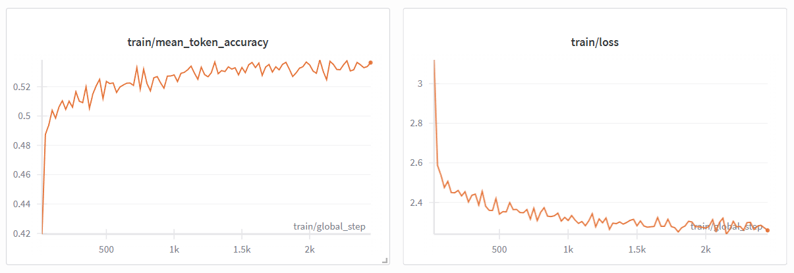
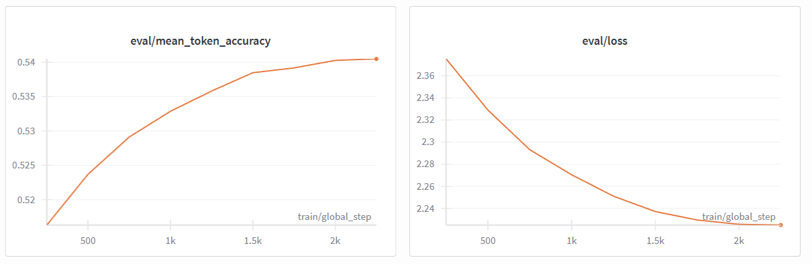

# Fine-tuning Results & Evaluation

This document provides a detailed analysis of the performance of the fine-tuned Qwen2.5-0.5B-Instruct model.

## 1. Quantitative Evaluation (ROUGE Metrics)
We evaluated the model on a test split of 100 samples using the ROUGE metric, comparing the fine-tuned version against the original base model.

| Metric | Base Model | Fine-tuned | Improvement |
| :--- | :--- | :--- | :--- |
| **ROUGE-1** | 0.2246 | 0.2646 | **+0.0400** |
| **ROUGE-2** | 0.0187 | 0.0485 | **+0.0298** |
| **ROUGE-L** | 0.1091 | 0.1493 | **+0.0402** |

## 2. Training Dynamics
The training was monitored via Weights & Biases. Below are the training and evaluation curves.

### Training Loss and Accuracy
The training loss showed a steady decline from ~3.0 to ~2.25, while the token-level accuracy increased from 0.42 to 0.53, indicating successful pattern recognition of the medical dialogue format.

### Evaluation Metrics
The evaluation loss decreased consistently to ~2.22, suggesting the model generalizes well to unseen patient queries without significant overfitting.

## 3. Qualitative Analysis (Inference Examples)

### Case 1: Dental Concern
**Patient:** Hello, I am seeking some professional help for a small white hard bump below my bottom front teeth. If anyone has any dental knowledge I would be really happy. The bump does not hurt unless I push very hard and it was noticed by my local dentist and he may refer me to a oral specialist. Does anyone know what this is??

**Model Response:** Hi, Welcome to Chat Doctor forum.  It seems you have developed ulcer in gums due to poor oral hygiene.  Visit a good dentist, get your teeth cleaned, and apply mouth wash over the affected area of gum. Maintain proper oral hygiene. You can take tab. Chlorpheniramine male, once daily at night. This will relieve inflammation. Hope this answers your query.  I will be available for further clarifications. Regards.

### Case 2: Back Pain & Aneurysm
**Patient:** I am having terrible pain in my middle back radiating off to the side on the left. Sharp and very painful to sit up when laying down or to turn. Also diagnosed with an abdominal aortic aneurysm which they are keeping an eye on the size is only 4 right now. could this pain be coming from that or what could this possibly be. Been to chiropractor with no relief. Now going to PT and still no relief. I am becoming very depressed and tired from lack of sleep.

**Model Response:** Hello, Thanks for consulting ChatDoctor. Read your query as you have sharp burning pain over back of abdomen may be due to many reasons like1. Herniated disc2. Spinal stenosis3. Muscle spasm4. Prolapsed disc5. Spinal tuberculosis etc... In my opinion you should consult physician first because if it will not respond to physical therapy then surgical procedure is needed so do warm water fomentation and apply muscle relaxant local application and take tab paracetamol 650\u00a0mg after food. Hope this will help you.

## 3. Pattern Recognition vs. Clinical Accuracy
A qualitative analysis of the model's output reveals that while it has mastered the **form** of a medical consultation, it still lacks the **substance** required for production-level medical advice.

### Successes in Linguistic Mimicry
The model has successfully internalized the "bedside manner" found in the HealthCareMagic dataset:
* **Standardized Greetings:** It consistently opens responses with professional greetings like "Hi, Welcome to Chat Doctor forum".
* **Formal Closings:** It reliably concludes interactions with "Hope this answers your query" or "Hope this will help you," showing it understands the social contract of a medical interaction.
* **Persona Maintenance:** It adheres to the `Doctor:` prefix and maintains a helpful, empathetic tone throughout the response.

### Critical Limitations and Inaccuracies
Despite the stylistic improvements, the model's actual advice is often medically generic or lacks deep reasoning:
* **Generic Diagnosis:** When a patient presented with sharp back pain and a known aneurysm, the model listed common causes like "muscle spasm" or "herniated disc". While these are common, they could lead a patient to ignore the more life-threatening condition (the aneurysm) also mentioned in the prompt.
* **Surface-Level Advice:** The model often defaults to broad advice like "maintain proper oral hygiene" or "visit a good dentist" regardless of the specific severity of the reported symptoms.
* **Pattern Hallucination:** It may suggest specific medications or dosages (e.g., "tab paracetamol 650 mg") simply because those patterns appeared frequently in its 10,000-sample training subset, rather than performing a clinical calculation[cite: 2, 3].

## 4. Requirements for Production Environments
For this model to be viable in a real-world healthcare setting, significant further development is required:
* **Full Dataset Training:** This experiment used only 10% (10,000 samples) of the available data. Training on the full 100k samples is necessary to expose the model to a broader range of medical conditions.
* **Extended Training:** The model was trained for only 1 epoch. Multiple epochs would be required to shift the model from "tone mimicry" to "knowledge retention."
* **Medical Grounding (RAG):** Instead of relying on internal weights, the model should be paired with Retrieval-Augmented Generation (RAG) to pull facts from verified medical journals or databases.
* **Clinical RLHF:** Alignment through Reinforcement Learning from Human Feedback (RLHF) by actual medical professionals is critical to ensure that safety and accuracy are prioritized over just "sounding" professional.

## 5. Conclusion
This project was conducted strictly for **learning purposes** to understand the QLoRA fine-tuning process. It successfully demonstrated that a Small Language Model (0.5B parameters) can be quickly adapted to follow complex structural and tonal requirements. However, it serves as a reminder that linguistic proficiency does not equal domain expertise.
